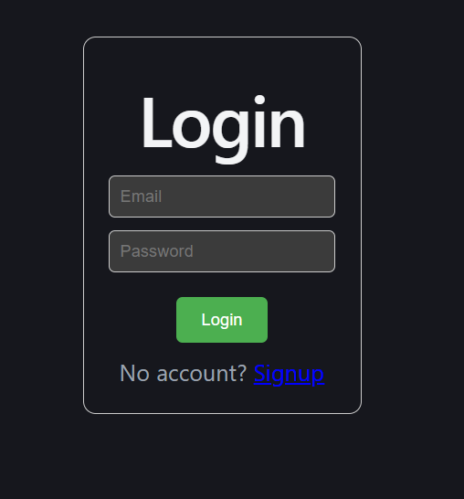
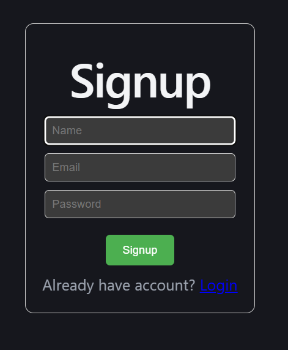

# Full Stack User Management System

A full-stack web application that allows users to register, login, and manage user data securely.  
The project demonstrates authentication using JWT with HTTP-only cookies and protected API routes.

## 🚀 Features

- User Signup
- User Login & Logout
- JWT Authentication
- HTTP-only Cookie Security
- Protected Routes with Middleware
- CRUD Operations (Create, Read, Update, Delete)
- RESTful API using Express
- MySQL Database Integration
- React Frontend Dashboard

## 🛠️ Tech Stack

Frontend:
- React
- Axios
- CSS

Backend:
- Node.js
- Express.js
- JWT Authentication
- Cookie Parser Middleware

Database:
- MySQL (XAMPP)

#Screenshot of Project 

//if you already have account login here

//if you don't have account first sign up here

// here you can update delete logout

Built by Anchal Bisht
