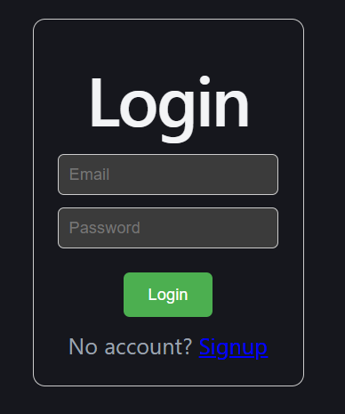
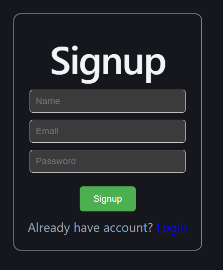
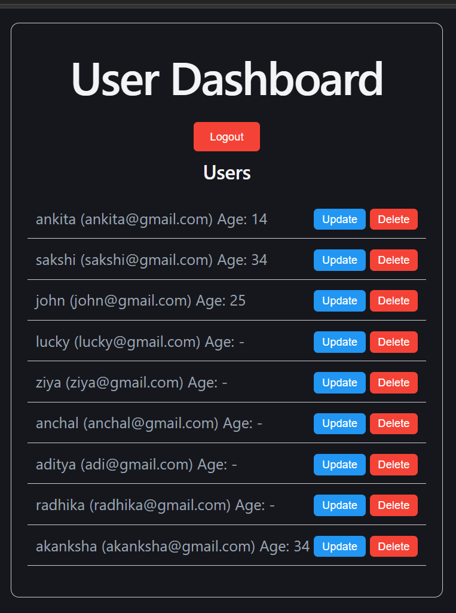

# Full Stack User Management System

A full-stack web application that allows users to register, login, and manage user data securely.  
The project demonstrates authentication using JWT with HTTP-only cookies and protected API routes.

## 🚀 Features

- User Signup
- User Login & Logout
- JWT Authentication
- HTTP-only Cookie Security
- Protected Routes with Middleware
- CRUD Operations (Create, Read, Update, Delete)
- RESTful API using Express
- MySQL Database Integration
- React Frontend Dashboard

## 🛠️ Tech Stack

Frontend:
- React
- Axios
- CSS

Backend:
- Node.js
- Express.js
- JWT Authentication
- Cookie Parser Middleware

Database:
- MySQL (XAMPP)

# Screenshot of Project 

  
Login page where existing users can securely access their accounts by entering credentials.

  
Signup page for new users to register their details and create an account before accessing the system.

  
Dashboard page that provides options to update book details, delete records, or log out of the application.

Built by Anchal Bisht
